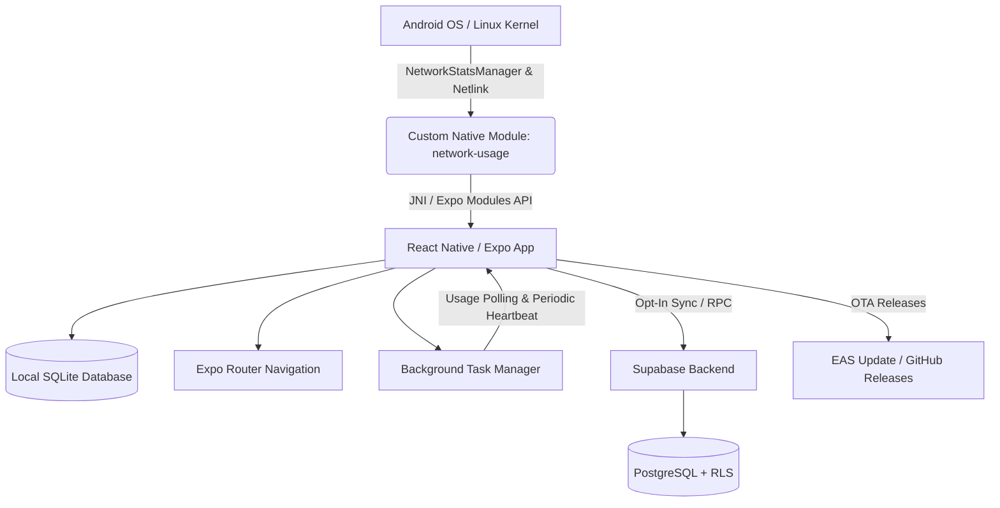

# NetTrack — Mobile App 📱

[](https://reactnative.dev)
[](https://expo.dev)
[](https://www.typescriptlang.org/)
[](LICENSE)
[](https://android.com)

**NetTrack** is a high-precision, privacy-first Android network tracking and diagnostics application built with React Native and Expo. It leverages a custom native Android module (`NetworkStatsManager`) to deliver byte-accurate traffic breakdowns per app, real-time speed monitoring, network probes, data limit alerts, and privacy-centric family sharing.

---

## 📑 Table of Contents

- [Features](#-features)
- [Architecture & Tech Stack](#-architecture--tech-stack)
- [Project Structure](#-project-structure)
- [Prerequisites & Getting Started](#-prerequisites--getting-started)
- [Custom Native Module (`network-usage`)](#-custom-native-module-network-usage)
- [Family Tracking & Supabase Setup](#-family-tracking--supabase-setup)
- [Privacy & Consent Model](#-privacy--consent-model)
- [Available Scripts](#-available-scripts)
- [Building & Releases](#-building--releases)

---

## ✨ Features

### 📊 Accurate Per-App Network Tracking

- **Android `NetworkStatsManager` Integration**: Direct system-level accounting of Wi-Fi and Mobile (Cellular) data usage for every installed and system application.
- **Upload & Download Breakdown**: Distinct metrics for incoming and outgoing data.
- **Foreground vs. Background**: Detailed split showing data consumed while using the app vs. passive background sync.
- **Flexible Ranges**: Today, Yesterday, Last 24 Hours, Last 7 Days, Last 30 Days, Billing Cycle, and Custom Date Ranges.

### ⚡ Live Speedometer & Traffic Monitor

- Real-time device-wide download and upload speed monitoring with a 60-second interactive sparkline chart.
- Recent 10-second app traffic activity tracker.

### 🔍 Usage Comparison & Analytics

- Side-by-side comparison between time periods (e.g. this week vs. last week).
- Identifies **"Biggest Movers"** (apps with major surges or drops in data consumption).

### 🛠️ Network Probe & Diagnostics

- Ping latency testing, active connection details, and network diagnostic utilities.

### ⚠️ Data Limits & Smart Alerts

- Monthly billing cycle tracking with custom data caps (separate limits for Mobile and Wi-Fi).
- Early warnings at configurable thresholds (e.g. 80%) and sudden spike anomaly notifications.

### 👨‍👩‍👧 Family Sharing (Opt-In Parent-Child Sync)

- QR Code and deep-link pairing (`nettrack://pair?...`).
- Zero-enforcement, privacy-preserving monitoring: parents view daily rollups and battery/active app context without screen monitoring, location tracking, or browsing inspection.
- In-app requests to raise data warning thresholds.

### 🌐 Bilingual & RTL Support

- Full internationalization in **English** and **Arabic (العربية)** with automatic right-to-left (RTL) layout switching via `i18next`.

### 🔄 Offline-First & OTA Updates

- Local **SQLite** storage (`expo-sqlite`) for offline historical caching.
- Integrated **EAS Update** client to check for, download, and install over-the-air updates.

---

## 🏗 Architecture & Tech Stack



- **Framework**: [Expo SDK 57](https://expo.dev) with [Expo Router](https://docs.expo.dev/router/introduction/) (typed routes enabled).
- **Runtime**: React Native 0.86.2 / React 19.2.3.
- **Language**: TypeScript 6.0.
- **Native Android Module**: Custom Kotlin module (`modules/network-usage`) exposing Android's `NetworkStatsManager` and `TrafficStats`.
- **Database & Storage**: `expo-sqlite` for structured local metrics, `expo-file-system` for CSV/JSON exports.
- **UI & Animations**: `react-native-reanimated` 4, `lucide-react-native`, `expo-glass-effect`.
- **Backend / Sync**: [Supabase](https://supabase.com) (PostgreSQL RPC with Row Level Security).

---

## 📁 Project Structure

```
mobile-app/
├── android/                   # Native Android project configuration
├── assets/                    # App icons, splash screens, and images
├── docs/                      # Technical specifications, plans & SQL schemas
│   ├── family-schema.sql      # Supabase schema & RPC functions
│   └── plans/                 # Architectural plans & feature designs
├── modules/
│   └── network-usage/         # Custom Android native module (Kotlin/TS)
├── scripts/                   # Helper scripts (e.g. icon generation)
├── src/
│   ├── app/                   # Expo Router screens and tabs
│   │   ├── (tabs)/            # Main bottom tabs: Usage, Compare, Live, Probe, Settings
│   │   │   ├── index.tsx      # Main Usage dashboard
│   │   │   ├── compare.tsx    # Usage comparison screen
│   │   │   ├── live.tsx       # Real-time traffic monitor
│   │   │   ├── probe.tsx      # Network probe & diagnostics
│   │   │   └── settings.tsx   # Settings, limits & privacy
│   │   ├── family/            # Family sharing screens (parent view, child status)
│   │   ├── usage/             # Detailed per-app usage drilldowns
│   │   ├── scan.tsx           # QR Code scanner for family pairing
│   │   ├── update.tsx         # In-app updater & release notes
│   │   └── _layout.tsx        # Root layout, theme & notification providers
│   ├── components/            # Reusable UI components
│   ├── constants/             # Design tokens, colors, storage keys
│   ├── features/              # Modular domain logic (archive, export, family, limits, live, usage)
│   ├── hooks/                 # Custom React hooks
│   └── i18n/                  # Localization (en.ts, ar.ts)
├── app.json                   # Expo application manifest
├── eas.json                   # Expo Application Services build profiles
├── package.json               # Node dependencies and scripts
└── tsconfig.json              # TypeScript configuration
```

---

## 🚀 Prerequisites & Getting Started

### Prerequisites

- [Node.js](https://nodejs.org/) (v18+) or [Bun](https://bun.sh/)
- [Android Studio](https://developer.android.com/studio) with Android SDK and an Android 8.0+ (API 26+) physical device or emulator.
- _Note:_ Because NetTrack uses a custom native Android module (`NetworkStatsManager`), testing per-app stats requires a **development build** (`expo run:android`), not standard Expo Go.

### Installation

1. Clone the repository and navigate into the `mobile-app` directory:

   ```bash
   cd mobile-app
   ```

2. Install dependencies:

   ```bash
   bun install
   # or
   npm install
   ```

3. Run the development build on Android:

   ```bash
   bun run android
   # or
   npx expo run:android
   ```

4. **Grant Usage Access Permission**:
   - On the first launch, Android requires `PACKAGE_USAGE_STATS` permission to query per-app network metrics.
   - Tap the prompt in the app to open Android Settings → **Usage Access** → Enable for **NetTrack**.

---

## 🔌 Custom Native Module (`network-usage`)

Located at [`modules/network-usage`](file:///f:/Projects/network_tracker/mobile-app/modules/network-usage):

- **Native Implementation**: Kotlin code interfacing with `android.app.usage.NetworkStatsManager`, `android.net.TrafficStats`, and `android.content.pm.PackageManager`.
- **Query Types**:
  - `querySummary(bucket, startTime, endTime)`: Queries system buckets for mobile/Wi-Fi usage aggregated per UID.
  - `queryDetailsForUid(uid, startTime, endTime)`: Queries foreground vs. background state for a specific app.
  - `getLiveDeviceBytes()`: Fast poll for current interface RX/TX counters.
- **Package Resolver**: Resolves Android UID to app labels, package names, and system app identifiers.

---

## ☁️ Family Tracking & Supabase Setup

Family sync enables parent devices to check child device usage securely without accounts or passwords.

1. Create a project on [Supabase](https://supabase.com).
2. Open the **SQL Editor** in Supabase and execute the contents of [`docs/family-schema.sql`](file:///f:/Projects/network_tracker/mobile-app/docs/family-schema.sql).
3. The SQL script creates:
   - `family_snapshots` table with Row Level Security (RLS).
   - Three RPC functions exposed to public `anon` role: `family_push`, `family_pull`, and `family_forget`.
   - `family_prune()` function for 90-day automatic data cleanup (schedule via `pg_cron`).
4. Update `app.json` with your Supabase URL and public `anonKey`:
   ```json
   "extra": {
     "family": {
       "url": "https://your-project.supabase.co",
       "anonKey": "your-public-anon-key"
     }
   }
   ```

---

## 🔒 Privacy & Consent Model

NetTrack is designed from the ground up to respect user privacy:

- **Local-First**: All metrics are calculated and stored locally on the device.
- **Zero Third-Party Analytics**: No analytics trackers, no ad SDKs, no telemetry.
- **Family Sharing Consent**: Nothing leaves a device unless explicitly paired via QR code or pairing link. Unpairing from either device immediately and permanently deletes all remote records.

### Verbatim Consent Disclosures

> **What is shared** (once paired as a child):  
> _"Device details and daily app data usage broken down by Wi-Fi and mobile data (top 50 apps). Periodic status check-ins (battery level, active foreground app, network type) and data limit increase requests."_

> **What never leaves the device**:  
> _"What never leaves this device: your location, Wi-Fi network name, browsing content, message content, and screen contents."_

- **No Remote Control / Enforcement**: Data limits set by parents only update local warning alerts on the child's device; they cannot disconnect or throttle network access.

---

## 📜 Available Scripts

| Command               | Description                                                      |
| --------------------- | ---------------------------------------------------------------- |
| `bun run start`       | Starts the Expo development server                               |
| `bun run android`     | Builds and launches the Android development app                  |
| `bun run typecheck`   | Validates TypeScript types across the project                    |
| `bun run test`        | Runs Jest unit tests                                             |
| `bun run lint`        | Runs Expo linter                                                 |
| `bun run build:apk`   | Builds a standalone Android release APK via EAS                  |
| `bun run update:prod` | Publishes an Over-The-Air (OTA) update to the production channel |

---

## 📦 Building & Releases

Standalone builds are configured with [EAS Build](https://docs.expo.dev/build/introduction/):

```bash
# Build standalone release APK
bun run build:apk

# Build preview APK for testing
bun run build:preview
```

Output APKs can be hosted directly on GitHub Releases to be distributed via the NetTrack Website.

---

## 📄 License

This project is licensed under the [MIT License](LICENSE).
