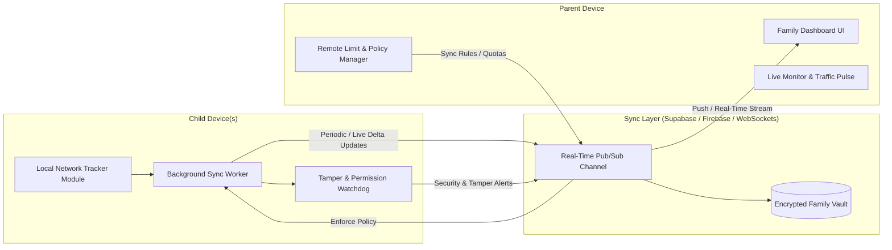

Listed directory network_tracker
Viewed package.json:1-65
Listed directory src
Listed directory modules
Listed directory features

Here is an **enhanced, production-grade feature blueprint** and a **copy-paste ready master prompt** designed specifically for your network tracking application.

---

# 👨‍👩‍👧‍👦 Family & Parental Network Tracking: Complete Feature Specification



---

## 1. 🔗 Pairing & Multi-Child Management

- **Zero-Friction QR Pairing:** Parent generates a time-sensitive QR code or 6-digit secure pairing PIN on their device; the child scans it to bind immediately.
- **Multi-Child & Multi-Device Support:** Single parent account can monitor multiple children, and each child can have multiple devices (e.g., Phone + Tablet) grouped under one profile.
- **Dual Parent / Co-Guardian Role:** Allow secondary parents (e.g., Mom & Dad) to co-manage the child profile with synchronized permissions.
- **Role Switcher & Lock:** Child mode locks settings with Parent PIN / Biometrics so the child cannot change configurations or unpair.

---

## 2. ⚡ Live Activity & Real-Time Monitoring

- **Live Speed Gauge & Pulse:** Shows current real-time upload/download speeds of each child in real time.
- **Active Foreground App Indicator:** Shows what app is currently consuming data (e.g., _“Leo is currently using YouTube (3.4 MB/s)”_).
- **Connection Type & Network Inspector:** Indicates if the child is on **Cellular / Mobile Data** (with carrier info) or **Home / Public WiFi** (with SSID).
- **Battery & Connectivity Heartbeat:** Displays the child device's battery level and online/offline connectivity status.

---

## 3. 📊 Historical Breakdown & Smart Insights

- **Per-App & Category Categorization:**
  - Categorizes traffic into **Gaming** (Roblox, Minecraft), **Streaming** (YouTube, Netflix), **Social** (TikTok, Instagram), **Education**, and **Background Systems**.
- **Timeline / Hourly Heatmap:** Visual 24-hour timeline showing when during the day data was consumed most heavily.
- **Comparative Trend Analysis:** Day-over-day and week-over-week reports (e.g., _"Data usage increased by 35% on weekends"_).
- **Data Waste & Background Leaks:** Identifies rogue apps consuming heavy background data when the screen is off.

---

## 4. 🛡️ Data Budgets, Time Schedules & Remote Controls

- **Daily / Weekly / Monthly Quotas:** Set total data caps (e.g., 2 GB/day for Mobile Data, Unlimited for Home WiFi).
- **App-Specific Limits:** Set allowances for specific apps or categories (e.g., 1 hour or 500 MB max for TikTok per day).
- **Bedtime & Study Hour Schedules:** Define automated quiet windows (e.g., 9:00 PM – 6:00 AM) where non-essential data triggers alerts.
- **Remote "Instant Pause / Resume":** A one-tap button for parents to remotely pause or throttle data access / trigger a reminder overlay.
- **Bonus Data Allowance:** Parents can remotely reward the child with extra 500 MB / 1 GB with a single tap.

---

## 5. 🚨 Smart Alerts & Tamper Detection

- **Usage Threshold Warnings:** Instant push notifications when child reaches 50%, 80%, and 100% of their data limit.
- **Tamper & Disconnect Alert:** Instant alert if the child disables background permissions, revokes Usage Access, disconnects from the internet, or attempts to uninstall the tracker.
- **Unusual Surge Detection:** AI/Heuristic alert if an unknown app downloads >1 GB in a short burst.
- **New App Installation Alert:** Notifies parent when a new network-consuming app is installed on the child's device.

---

## 6. 🎨 Child-Friendly Transparent UX

- **Child Dashboard:** A gamified, clear interface showing their remaining daily quota, current speed, and badge rewards for staying under budget.
- **"Ask for More Data" Request Button:** Child can send a 1-tap request to the parent for additional data or time, which appears as an actionable notification on the parent's device.

---

# 🚀 Copy-Paste Ready Master Prompt

You can use the refined prompt below to implement this feature:

```markdown
### Objective

Implement a "Parental Network Monitoring & Family Sharing" feature for our React Native / Expo network tracker app. This feature enables parents to link their children's devices, monitor real-time and historical network usage, set limits/schedules, and receive tamper alerts.

### Key Requirements

#### 1. Device Pairing & Role Management

- Implement two roles: "Parent Mode" and "Child Mode".
- Parent generates a secure QR code / 6-digit PIN; Child scans to link.
- Support multiple children profiles with custom avatars, device names, and tags.
- Secure Child Mode with PIN/Biometric lock to prevent unauthorized settings modifications or unlinking.

#### 2. Live & Historical Usage Sync

- **Live Monitoring:** Stream current active foreground app, real-time download/upload speed (KB/s or MB/s), active network type (WiFi SSID vs Cellular/SIM), and online/offline heartbeat.
- **Historical Tracking:** Sync daily/weekly/monthly per-app usage, categorizing apps into Social, Video Streaming, Gaming, Education, and Utilities.
- **Hourly Activity Heatmap:** Record data consumption timeline to visualize night-time or study-hour usage.

#### 3. Remote Policy & Quota Controls

- Configure daily/weekly data limits for Mobile and WiFi separately.
- Define app-specific quotas and Bedtime / Study schedules.
- Include a 1-tap "Remote Pause" toggle and an "Extend Limit / Grant Bonus Data" action.
- Allow children to send an in-app "Request More Data" prompt to the parent.

#### 4. Safety, Tamper-Proofing & Alerts

- Push notification system for: Limit reached (80%, 100%), Sudden usage spikes, and Night-time data activity.
- Tamper Watchdog: Trigger immediate parent alert if Usage Access permissions are revoked, the app is killed, or background sync fails for >15 minutes.

#### 5. Architecture & Tech Stack

- **Frontend:** React Native / Expo Router with smooth Lucide icons and Reanimated glassmorphism cards.
- **Backend / Sync Layer:** Lightweight real-time sync (Supabase / Firebase Realtime DB or WebSockets) with end-to-end encryption for privacy and low battery overhead.
- **Local Storage:** Expo SQLite / MMKV for local caching and offline-first durability.
```
